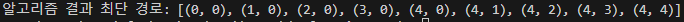
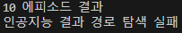
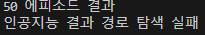
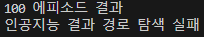
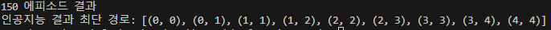
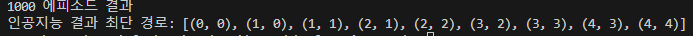

# Q-learning-Study
Q-learning Study

## Requirements
- Python 3.x
- numpy
- torch
- tqdm


## Usage
1. **Run the Q-learning:**
    ```bash
    python q_learning_algorithm.py
    ```
    or
    
    ```bash
    python q_learning_ai.py
    ```

2. **Check the results:**
   The result can be visualized as shown in the screenshot below.

    Algorithm </br>
    

    AI (10 episodes) </br>
    

    AI (50 episodes) </br>
    

    AI (100 episodes) </br>
    

    AI (150 episodes) </br>
    

    AI (1000 episodes) </br>
    
